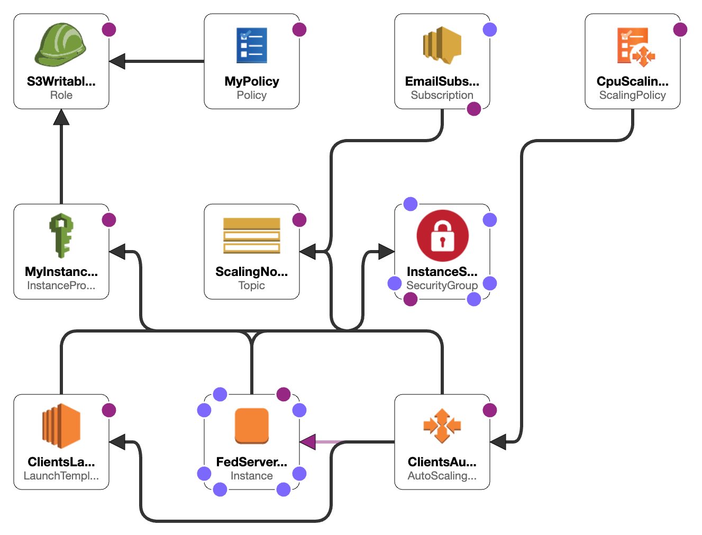

# CloudLab Federated Learning Project

This repository contains a demonstration of a Centralized Federated Learning system using AWS CloudFormation to provision the infrastructure of an Auto Scaling group and Python scripts to simulate a federated learning server and multiple clients.


## Table of Contents

- [Overview](#overview)
- [Directory Structure](#directory-structure)
- [Federated Learning](#federated-learning)
  - [Scripts](#scripts)
  - [Task](#task)
- [Architecture Diagram](#architecture-diagram)
- [System Overview](#system-overview)
- [Design choices](#design-choices)
- [Usage](#usage)

## Overview

This project primary objectives are:

1. Demonstrate the power of AWS CloudFormation to define and provision AWS infrastructure.
2. Illustrate the concept of federated learning with a centralized server and multiple clients. [Flower Federated Learning Framework](https://flower.dev/) is used to implement the federated learning system.

## NOTE

The project is tailored to fit within **AWS's free-tier** limitations, ensuring minimal expenses while demonstrating a functional federated learning system. Future versions could explore beyond these constraints for enhanced performance.   

## Directory Structure

```bash
cloudlab-fed
├── README.md
├── cloudformation-fl-mirko.yml
├── src
│   ├── fed_client.py
│   ├── fed_server.py
│   └── run_local.sh
└── template-aws-designer.png
```

- `cloudformation-fl-mirko.yml`: Contains the AWS CloudFormation template to set up the required AWS infrastructure.
  
- `/src`: Contains the Python source code simulating the federated learning process with a server and multiple clients.

## Federated Learning

Federated Learning is a machine learning approach where a model is trained across multiple devices or servers while keeping the data localized. The centralized server aggregates the model updates from clients and updates the global model.

### Scripts

- `fed_server.py`: Simulates the centralized federated learning server.
- `fed_client.py`: Simulates a federated learning client that trains on local data and sends model updates to the server.

### Task

For demonstration purposes, the federated learning setup utilizes a classification task based on the **CIFAR-10 dataset** The dataset gets randomly split across the federated clients, and each client trains locally on its subset of data.

The model of choice for this task is the **MobileNetV2**, a lightweight neural network architecture optimized for speed and performance, especially on mobile and embedded devices. Its design makes it apt for federated learning scenarios where computational resources might be limited on client devices.

During the training cycle, each federated client uses its subset of CIFAR-10 data to train the MobileNetV2 model locally. At each `round`, the clients send their model updates to the centralized server. The server then aggregates these updates to improve the global model. This iterative process continues for several rounds, ensuring that the global model benefits from the diverse data subsets present across the clients, while ensuring data privacy by not centralizing the raw data.

## Architecture Diagram




## System Overview

1. **Parameters**: Parameters are given with default values like VPC Id, Subnet Id, EC2 instance type, KeyPair, number of starting clients (ClientCount), S3 bucket name, and operator email for notifications. It also has a parameter for enabling/disabling the scaling policy and a new parameter for training rounds. Specifically, (**`TrainingRounds`**) is an example of a parameter to pass to the script application.

2. **Conditions**: A condition to check whether the scaling policy should be created or not based on the **`EnableScalingPolicy`** parameter.
3. **Resources**: The core of the template, where EC2 instances, security groups, launch templates, autoscaling groups, scaling policies, and SNS topics are defined.
    - **FedServerEC2Instance**: This is the main federated learning server. It runs the federated learning server code and interacts with multiple clients.
    - **InstanceSecurityGroup**: Defines the security group that allows SSH and other traffic to the EC2 instances.
    - **ClientsLaunchTemplate**: Contains the launch configuration for the federated learning clients. It defines what type of EC2 instance to launch, its security group, and the user data script that sets up the client's environment and runs the federated learning client code.
    - **ClientsAutoScalingGroup**: This auto-scaling group is responsible for launching multiple federated learning clients. It scales based on the number of clients specified in the "ClientCount" parameter.
    - **CpuScalingPolicy**: An optional scaling policy that scales the number of clients based on their average CPU utilization.
    - **ScalingNotificationTopic**: An SNS topic that notifies the specified email when there are scaling operations, like launching or terminating EC2 instances.
    - **EmailSubscription**: A subscription to the SNS topic so that notifications are sent to the specified email address.

## Design choices

1. **UserData Script**: The EC2 instances are set up using a **`UserData`** script. This script updates the system, installs necessary software packages, clones the Git (public) repository containg the scripts, and then runs the federated learning server or client code.
    - **Instance Identification**: in the UserData script, **`ec2-metadata`** is used to get the instance ID and private IP
2. **Scaling based on CPU Utilization**: the auto-scaling group for the clients has a scaling policy based on average CPU utilization. 
    - **Target Tracking Scaling Policy**: it tries to maintain the group's average CPU utilization close to the set target (50% for demonstration puroposes).
3. **Security**: The **`InstanceSecurityGroup`** opens up all ports for inbound traffic from any IP (0.0.0.0/0). This can be restricted to the required ports, like 8080 generally used by Flower FL framework, and 22 for SSH.
4. **Custom EC2 Instance Images**: A custom AMI (ami-030c79dfe54c09450), derived from the standard Amazon Linux 2 AMI (HVM) with an SSD Volume Type, has been crafted and published with preloaded packages. This drastically reduces boot time for instances.
5. **Dependencies**: The **`ClientsAutoScalingGroup`** depends on the **`FedServerEC2Instance`**. This ensures the server is up and running before any clients are launched.
6. **Email Notifications**: The system is set to send email notifications for various scaling events.
7. **S3 Bucket Interactions**: Initially, the idea was to deploy federated learning scripts to EC2 instances using Amazon S3. However, this approach was set aside due to cost concerns related to data transfers on a free-tier AWS account and to avoid setting up specific IAM permissions for EC2-S3 interaction. Commented lines referencing S3 in the code remain as a hint to this initial consideration and for future development.

## Usage

1. **Deploy the AWS CloudFormation Stack via AWS Console**:
    - Navigate to the AWS CloudFormation console.
    - Create a new stack and upload the `cloudformation-fl-mirko.yml`
    - Fill in the required parameters and create the stack. This will provision the EC2 instances and the necessary resources.

2. **Deploy the AWS CloudFormation Stack via AWS CLI**:
    - Clone this repository to your local machine.

    ```bash
    git clone https://github.com/mirqr/cloudlab-fed.git
    cd cloudlab-fed
    ```

    - Ensure you have the AWS CLI installed and configured with your AWS credentials and a key pair available in your AWS account.
    - Run the following command to deploy the CloudFormation stack.

    ```bash
    aws cloudformation create-stack --stack-name FedStack --template-body file://cloudformation-fl-mirko.yml --parameters ParameterKey=ClientCount,ParameterValue='4' ParameterKey=OperatorEMail,ParameterValue='YOUR_EMAIL' --parameters ParameterKey=KeyName,ParameterValue=YOUR_KEY_PAIR_NAME
    ```

3. **Monitor the Federated Learning Server**:
    - Once the CloudFormation stack is successfully deployed, navigate to the EC2 dashboard.
        - Note: The EC2 instances, upon startup, will automatically clone this repository and run the federated learning scripts from the `/src` directory. As clients get instantiated, they'll automatically start the training process and connect to the federated learning server.
    - Identify the **`FedServer`** instance. Use your preferred SSH tool to connect to the server or client instances using the provided key pair.
    - Monitor the progress on the instances **terminal**
        - Check `client_output.txt` and `server_output.txt` in the root (`/`) folder for the output of the federated learning server and clients.
    - Monitor the resources on the **AWS Console**
        - Monitor the EC2 dashboard for the instances.
        - Monitor the AutoScaling Groups dashboard for the clients.
        - Monitor the SNS dashboard for notifications.

4. **Terminate and Cleanup**:
    - Once done, ensure you terminate the CloudFormation stack to avoid incurring any unintended costs.
    - Navigate to the CloudFormation dashboard, select the deployed stack, and choose "Delete".
    - Or, run the following command to delete the stack via AWS CLI.

    ```bash
    aws cloudformation delete-stack --stack-name FedStack
    ``` 
